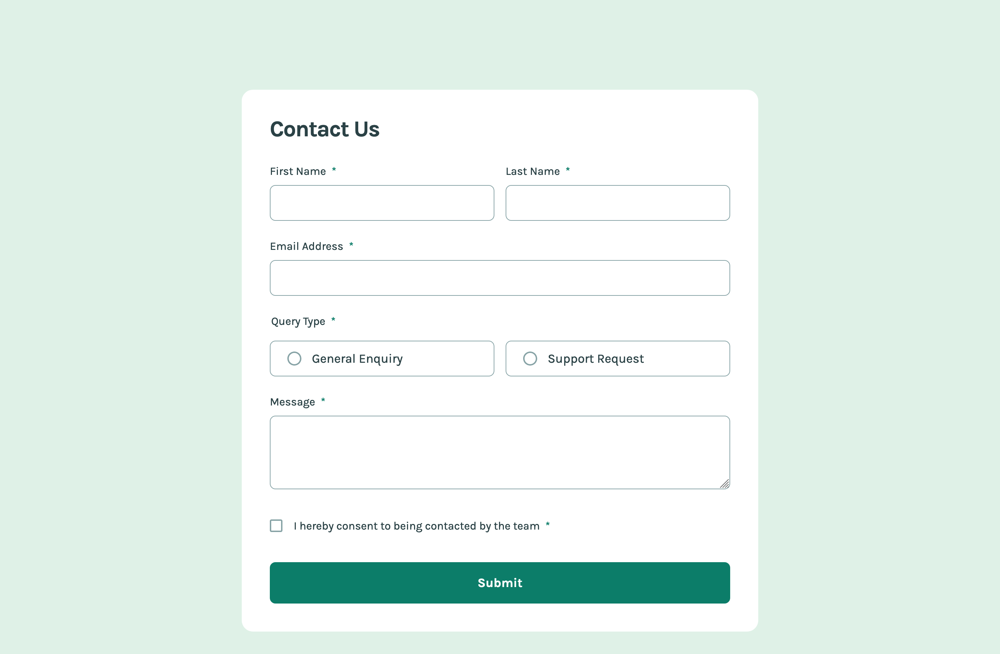
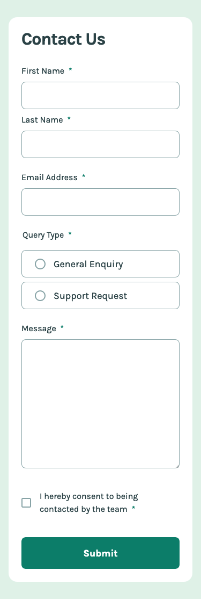

# Frontend Mentor - Contact form solution

This is a solution to the [Contact form challenge on Frontend Mentor](https://www.frontendmentor.io/challenges/contact-form--G-hYlqKJj). Frontend Mentor challenges help you improve your coding skills by building realistic projects.

## Table of contents

- [Overview](#overview)
  - [The challenge](#the-challenge)
  - [Screenshot](#screenshot)
  - [Links](#links)
- [My process](#my-process)
  - [Built with](#built-with)
  - [What I learned](#what-i-learned)
  - [Continued development](#continued-development)
  - [Useful resources](#useful-resources)
- [Author](#author)

## Overview

### The challenge

Users should be able to:

- Complete the form and see a success toast message upon successful submission
- Receive form validation messages if:
  - A required field has been missed
  - The email address is not formatted correctly
- Complete the form only using their keyboard
- Have inputs, error messages, and the success message announced on their screen reader
- View the optimal layout for the interface depending on their device's screen size
- See hover and focus states for all interactive elements on the page

### Screenshot




### Links

- Solution URL: [https://github.com/srijanss/contact-form](https://github.com/srijanss/contact-form)
- Live Site URL: [https://srijanss.github.io/contact-form/](https://srijanss.github.io/contact-form/)

## My process

### Built with

- Semantic HTML5 markup
- CSS custom properties
- Flexbox
- CSS Grid
- Mobile-first workflow
- [Vite](https://vitejs.dev/) - Lightweight frontend tooling
- [PostCSS](https://postcss.org/) - Tool to transform CSS using plugins

### What I learned

I have learnt how to make accessible forms by

- making the form accessible using keyboard
- using autocomplete attribute and different tokens for different input types
- use of different aria-describedby attribute to describe more on what the input field is about and how to input values
- hiding redundant data from screen readers using aria-hidden attribute
- use of aria-invalid attribute to announce field is invalid and the error message based on aria-describedby

```html
<div class="form-input-group">
  <label for="email-address">
    Email Address<span class="required-label" aria-hidden="true">*</span>
  </label>
  <input
    type="email"
    id="email-address"
    name="emailAddress"
    autocomplete="email"
    aria-invalid="false"
    aria-describedby="emailAddress-error"
    required
  />
  <p class="error-message" id="emailAddress-error" hidden></p>
</div>
```

I have also learnt,

- how to make the toast message or modal accessible to the screen readers
- the use of aria-live, role="alert" and aria-atomic attributes help annouce the success message of toast in the solution

```html
<article class="toast" aria-live="assertive" role="alert" aria-atomic="true">
  <h2>Message Sent!</h2>
  <p>Thanks for completing the form. We'll be in touch soon!</p>
</article>
```

- I set the aria-invalid="false" on load in all the input elements, and when there is an error on submit then I changed attribute aria-invalid="true" so that screen-readers annouce the input is invalid and error message is read out
- similarly when user starts typing on the input field which has error message, then the error-message disappears

```js
showError(form, errorList) {
    const errorFieldElements = [];
    for (const error of errorList) {
      const fieldElement = form.querySelector(`[name="${error.fieldName}"]`);
      fieldElement.classList.add("error");
      errorFieldElements.push(fieldElement);
      fieldElement.setAttribute("aria-invalid", "true");
      const errorElement = this.shadow.getElementById(
        `${error.fieldName}-error`
      );
      errorElement.textContent = error.message;
      errorElement.hidden = false;
    }
    if (errorFieldElements.length > 0) {
      errorFieldElements[0].focus();
    }
  }

  hideError(fieldElement) {
    fieldElement.setAttribute("aria-invalid", "false");
    fieldElement.classList.remove("error");
    const fieldName = fieldElement.getAttribute("name");
    const errorElement = this.shadow.getElementById(`${fieldName}-error`);
    errorElement.textContent = "";
    errorElement.hidden = true;
  }
```

### Continued development

Planning to develop full stack app with server side validation of data.

### Useful resources

- [Accessible Form Instructions](https://www.w3.org/WAI/tutorials/forms/instructions/) - very helpful information on how to make forms accessible for all users
- [HTML input autocomplete](https://developer.mozilla.org/en-US/docs/Web/HTML/Attributes/autocomplete) - very helpful information about the autocomplete attribute and different tokens that can be used on it

## Author

- Website - [Srijan Manandhar](https://github.com/srijanss)
- Frontend Mentor - [@srijanss](https://www.frontendmentor.io/profile/srijanss)
